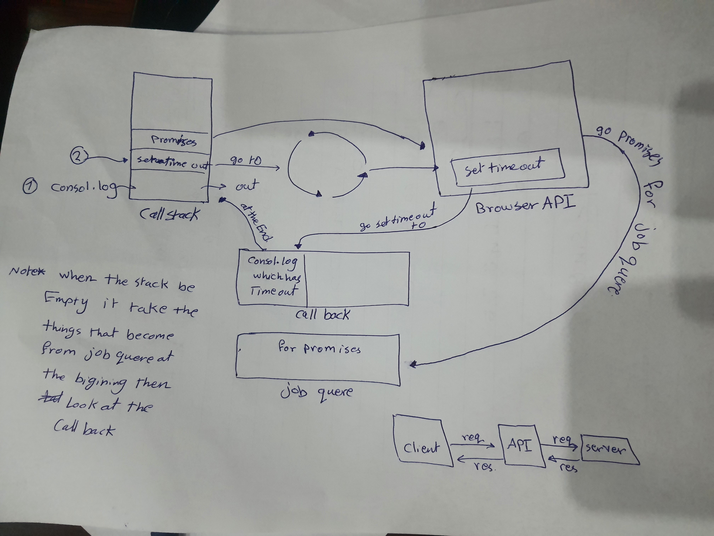
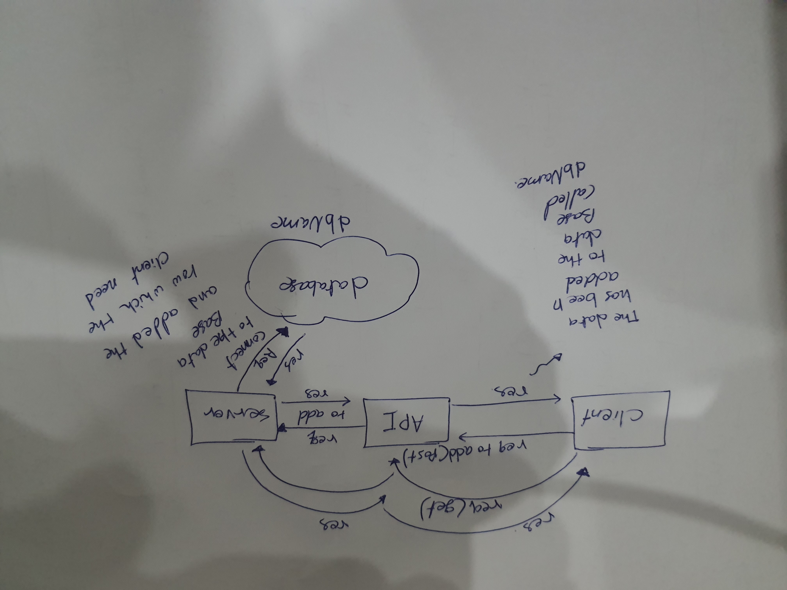

# Movies-Library
## Movies-Ibrary - 1

**Author Name**: ASMA NASSAR

### WRRC
.
.
.

## Overview

web browser loads a webpage using various protocols one of them called (DNS) it's Domain Name System protocol to convert a domain name into an IP address.
DNS is like the phone book of the Internet; it takes in domain names (much like human names) and turns them into IP addresses (much like phone numbers).
A URL (Uniform Resource Locator) is a unique identifier used to locate a resource on the Internet. It is also referred to as a web address. URLs consist of multiple parts -- including a protocol and domain name -- that tell a web browser how and where to retrieve a resource.

End users use URLs by typing them directly into the address bar of a browser or by clicking a hyperlink found on a webpage, bookmark list, in an email or from another application.

## Getting Started

- Create a repository called Movies-Library on GitHub
- Initialize your project by running the following command "npm init -y"
- Create a new branch called Task11
- Create basic file structure (server.js, .gitignore, .eslintrc.json )
- Install the required packages for this task: npm install express cors
- Create a route with a method of get and a path of.
- Create a function to handle the server error (status 500)
- Create a function to handle "page not found error" (status 404)
- after that i need to test my server so go to the terminal and type npm test
- go to the web and type localhost:3000

## Project Features
- when i type localhost:3000 go to the home page
- when i type localhost:3000/favorit go to the next page call welcom
- when i type any thing error go to the page like 404 error 

### Asyncronuns
this operation can be triggered only with tow things

* web API/browser
* Promisses
## promisses means resolve (.then)and reject (.catch)
### API
* it is Application user interface
* it will take a "req" from client and take it as areq to server and take the "res" from server and go back to the client.
* API can read and understand another language

### Data base Managment system
* Database Management System (DBMS) is a software for storing and retrieving users’ data while considering appropriate security measures. It consists of a group of programs which manipulate the database. The DBMS accepts the request for data from an application and instructs the operating system to provide the specific data. In large systems, a DBMS helps users and other third-party software to store and retrieve data.

### Here, is the list of some popular DBMS system:

* MySQL
* Microsoft Access
* Oracle
* PostgreSQL
* dBASE
* FoxPro
* SQLite
* IBM DB2
* LibreOffice Base
* MariaDB
* Microsoft SQL Server etc.